# Configuración mTLS entre Apigee y servicio Backend

### ¿Qué es mTLS?

El **TLS Mutuo (mTLS)** es una extensión de **Transport Layer Security
(TLS)** que, además de la autenticación del servidor mediante un
certificado, también requiere la autenticación del cliente a través de
un certificado. En otras palabras, en una conexión mTLS:

1.  El servidor presenta su certificado para que el cliente lo valide.

2.  El cliente también presenta su certificado, y el servidor lo valida.

3.  Ambas partes confían en los certificados que han intercambiado y la
    comunicación se encripta.

### mTLS en Apigee

En Apigee X las peticiones realizadas a través de un Apiproxy hacia un
backend pueden ser divididas en dos partes, el tráfico que vienen desde
los clientes hacia Apigee (Northbound) y el tráfico que parten desde
Apigee hacia los backend services (Southbound).

En el siguiente demo ser realizara la implementación mTLS con un
servicio backend como **southbound** significa que cada petición desde
Apigee hacia el servicio debe cumplir con este proceso de doble
validación de certificados.

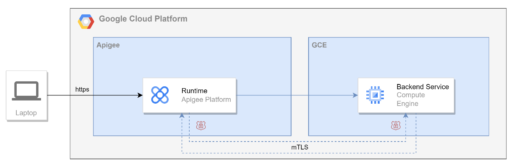

### Beneficios de mTLS

1.  **Autenticación bidireccional**: Ambos participantes (cliente y
    servidor) son autenticados mediante certificados.

2.  **Mejora de seguridad**: Al requerir la autenticación de ambos
    extremos, se minimiza el riesgo de ataques man-in-the-middle y
    suplantaciones de identidad.

3.  **Cifrado de extremo a extremo**: La conexión está completamente
    cifrada, lo que protege la integridad y la confidencialidad de los
    datos en tránsito.

4.  **Control de acceso refinado**: Solo los clientes con certificados
    válidos podrán acceder al backend, reforzando la seguridad de la
    API.

### Objetivo de la demo

Implementar las configuraciones necesarias para realizar una conexión
Southbound en Apigee usando certificados autofirmados para lograr la
comunicación mTLS entre Apigee y un Microservicio sirviendo como
Backend.

## Flujo de Comunicación mTLS entre Apigee y un Backend

A continuación, se muestra el flujo de comunicación para una autenticación mutua TLS (mTLS) entre Apigee y un servicio backend:

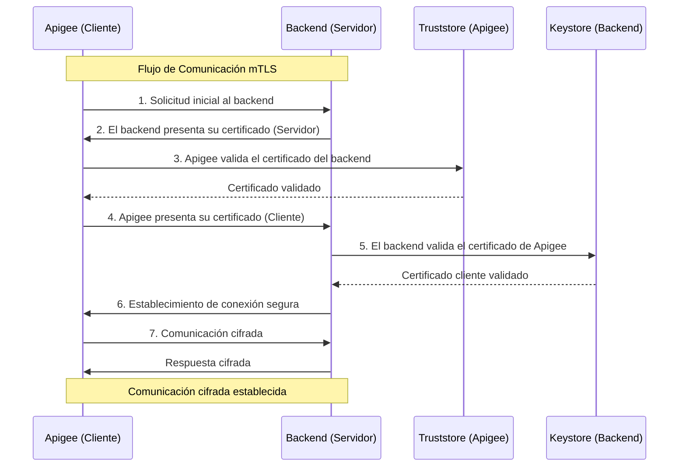

### Premisas:

- Se realizará la prueba usando un Apigee de evaluación.

- El MS se desarrollará en Spring boot con la configuración básica para
  habilitar la autenticación mTLS.

- El MS será expuesto en una VM de GCE para acceder directamente a la
  configuración mTLS del mismo.

- La prueba se realizará con certificados autofirmados.

- No se realizará la implementación de políticas de autenticación ni
  seguridad en el proxy de Apigee, esto no es recomendado en ambientes
  pre productivos ni productivos, siempre se debe contar con algún
  mecanismo de autenticación hacia las apis expuestas en Apigee
  (recomendado OAuth2).

- Los demos y configuraciones generadas en este demo son solo
  demostrativas a nivel de un ambiente previo a producción, en caso de
  ejecutar en ambiente productivo se recomienda el uso de certificados
  generados por una entidad certificadora de confianza o en su defecto
  definir nombres y contraseñas acorde al ambiente en el cual será
  desplegada la autenticación.

### Actividades:

- Crear los certificados necesarios para intercambiar entre las partes.

- Realizar el desarrollo del MS para realizar la prueba de conexión.

- Construcción del Microservicio en Spring boot.

- Realizar la configuración de la infraestructura necesaria para la demo
  y ejecución del servicio de backend.

- Crear el proxy en Apigee.

- Crear el Keystore y Truststore en Apigee.

- Crear el Target server con la configuración requerida para soportar
  mTLS

- Realizar las pruebas de conexión desde Postman o CURL para validar los
  requerimientos de autenticación entre las partes.

## Crear los certificados necesarios para intercambiar entre las partes**

A continuación, se describen los pasos para la creación de los
certificados necesarios para implementar un demo de mTLS con
certificados autofirmados:

Para esto se requiere el uso de dos aplicaciones **openssl** y
**keytool**

**Certificado Entidad Certificadora (CA):** En primer lugar, se requiere
la creación de la Autoridad Certificadora (CA) la cual firmará los
diferentes certificados creados para el cliente y el server

1.  Crear el key de la CA.

```sh
openssl genpkey -algorithm RSA -out **ca-key.pem**
```

2.  Crear el certificado de la CA
```sh
openssl req -x509 -new -nodes -key ca-key.pem -sha256 -days 365 -out ca-cert.pem -subj "/C=CO/ST=Bogota/L=Bogota/O=DemomTLSCompany/OU=mTLS/CN=Entidad Certificadora"
```
**Certificados Backend (Servidor):** Creación de certificados y
almacenes de parte del servidor.

3.  Crear un **Subject Alternative Name** (Nombre Alternativo del
    Sujeto) (SAN) para idenficar las IPs o DNS a los que se les generará
    el certificado:

Crear el archivo archivo **san.cnf** (vim san.cnf) en incluir el
siguiente contenido

\[ req_distinguished_name \]<br>
C = CO<br>
ST = Bogota<br>
L = Bogota<br>
O = DemomTLSCompany<br>
OU = mTLS<br>
CN = 34.XX.XX.XX<br>
\[ req_ext \]<br>
subjectAltName = @alt_names<br>
\[ alt_names \]<br>
IP.1 = 34.XX.XX.XX

En este caso al ser un certificado autofirmado sin un DNS, se define la
IP que se asigna a la VM (Esta IP debe ser modificado según
corresponda). Este SAN será usado en los siguientes pasos.

4.  Generar clave privada del servidor
```sh
openssl genpkey -algorithm RSA -out server-key.pem
```
5.  Crear una CSR (Certificate Signing Request) usando la configuración
    con SANs
```sh
openssl req -new -key server-key.pem -out server.csr -config san.cnf
```
6.  Firmar el certificado del servidor usando la CA (incluyendo SANs)
```sh
openssl x509 -req -in server.csr -CA ca-cert.pem -CAkey ca-key.pem -CAcreateserial -out server-cert.pem -days 365 -sha256 -extensions req_ext -extfile san.cnf
```
7.  Crear un almacén de claves para el servidor
```sh
openssl pkcs12 -export -in server-cert.pem -inkey server-key.pem -out server-keystore.p12 -name server -password pass:changeit
```
8.  Crear el almacén de confianza del servidor y Agregar la CA al almacen de confianza
```sh
keytool -importcert -file apigee-client-cert.pem -keystore server-truststore.p12 -storepass changeit -alias client

keytool -import -alias ca -file ca-cert.pem -keystore server-truststore.p12 -storepass changeit
```
**Certificados Apigee (cliente)**: Creación de certificados y almacenes
de parte del cliente.

9.  Generar clave privada para el cliente (Apigee)

openssl genpkey -algorithm RSA -out **apigee-client-key.pem**

10. Crear una solicitud de firma de certificado (CSR) para el cliente
```sh
openssl req -new -key apigee-client-key.pem -out client.csr -subj "/C=CO/ST=Bogota/L=Bogota/O=DemomTLSCompany/OU=mTLS/CN=apigee-client"
```
11. Firmar el certificado del cliente usando la CA
```
openssl x509 -req -in client.csr -CA ca-cert.pem -CAkey ca-key.pem -CAcreateserial -out apigee-client-cert.pem -days 365 -sha256
```
12. Crear un almacén de confianza para el servidor para confiar en el
    certificado del cliente
```sh
openssl pkcs12 -export -in apigee-client-cert.pem -inkey apigee-client-key.pem -out client-apigee-keystore.p12 -name client -password pass:changeit
```
**Resultado:** Cómo resultado de este paso se deben obtener los
siguientes archivos:

- apigee-client-cert.pem

- apigee-client-key.pem

- ca-cert.pem

- ca-key.pem

- client-apigee-keystore.p12

- client.csr

- san.cnf

- server-cert.pem

- server.csr

- server-key.pem

- server-keystore.p12

- server-truststore.p12

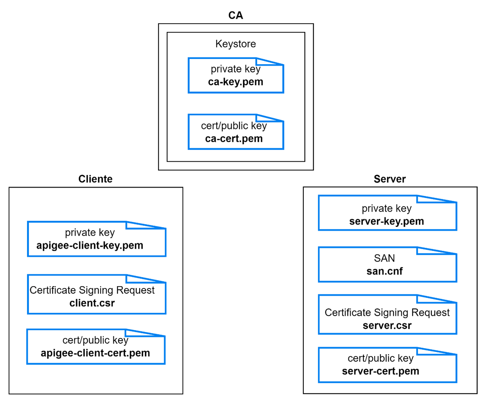

*Certificados generados*

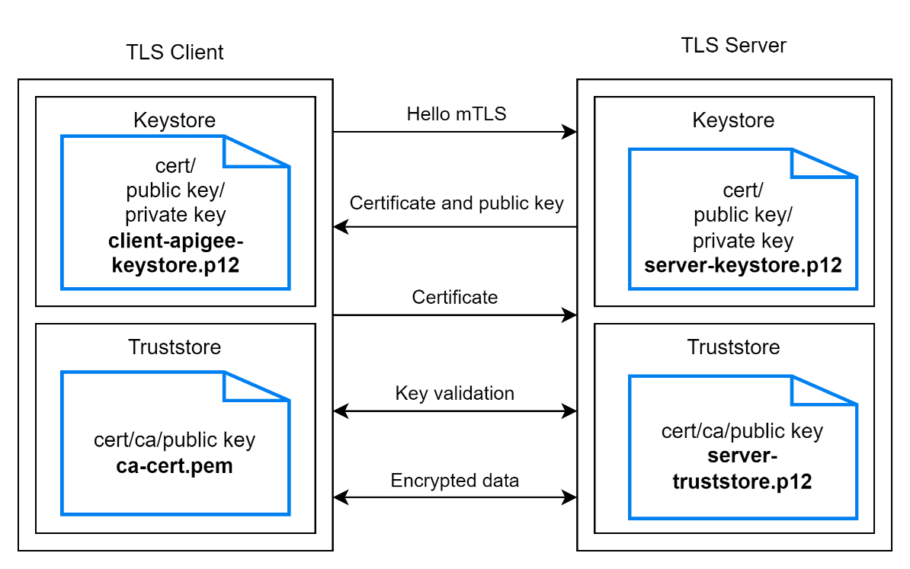

*Configuración requerida en cliente y servidor*

Una vez creados los certificados se procede a la creación del MS y
configuración en Apigee.

## Construcción del Microservicio en Spring boot

Se crea un servicio básico en Spring boot “**ms-mtls-demo**” del cual se
puede encontrar el código en este repositorio.

Este servicio expone una única operación GET en el controlador.

Para habilitar la autenticación mTLS se realiza la siguiente definición
en el archivo application.propeties

```conf
#Habilita el puerto 8443 para la comunicación TLS
server.port=${PORT:8443}
#Habilita la comunicación TLS
server.ssl.enabled=true
#Habilita la autenticación entre el cliente y el servidor
server.ssl.client-auth=need
#Define el keystore del server
server.ssl.key-store=classpath:**server-keystore.p12**
server.ssl.key-store-password=changeit
server.ssl.key-store-type=PKCS12
server.ssl.key-alias=server
#Define el truststore del server
server.ssl.trust-store=classpath:**server-truststore.p12**
server.ssl.trust-store-password=changeit
```
## Realizar la configuración de la infraestructura necesaria para la demo y ejecución del servicio de backend

Para realizar el despliegue del servicio se crea una VM con una imagen
de Ubuntu 20 que permita la ejecución de la aplicación java que reciba
las peticiones por el puerto 8443.

Configuraciones requeridas:

- Creación de regla de firewall sobre la etiqueta de red creada para
  permitir el tráfico por el puerto 8443

- Actualización de los paquetes de Ubuntu: sudo apt update

- Instalación de java 17 (openJDK17): sudo apt-get install
  openjdk-17-jdk

- Instalación de Maven: sudo apt install maven

- Clonar el proyecto: git clone ….

- Ejecutar la creación del archivo jar: mvn clean install

- Ejecutar la aplicación: java -jar
  target/ms-mtls-demo-1.0.0-SNAPSHOT.jar

En este caso en el “server” se almacenan el keystore
(**server-keystore.p12**) con el certificado y key del servidor lo que
habilitará la conexión TLS mediante HTTP y se almacena el truststore
(**server-truststore.p12**) el cual contiene el certificado del cliente
y la CA, esto permite validar contra estos el certificado enviado por el
cliente en el momento del handshake requerido por la autenticación
mutua.

Una vez realizada esta configuración y ejecución el servicio estará
escuchando las peticiones por el puerto 8443.

Para realizar las pruebas y validaciones de la autenticación de mTLS en
este punto podemos valernos del comando curl.

Ejecutando el siguiente comando se puede validar la autenticación mTLS:

Validación sin certificados:
```sh
curl -v https://34.XX.XX.XX:8443
 Trying 34.XX.XX.XX:8443...
 Connected to 34.XX.XX.XX (34.XX.XX.XX) port 8443 (#0)
 ALPN, offering h2
 ALPN, offering http/1.1
 CAfile: /etc/ssl/certs/ca-certificates.crt
 CApath: /etc/ssl/certs
 TLSv1.0 (OUT), TLS header, Certificate Status (22):
 TLSv1.3 (OUT), TLS handshake, Client hello (1):
 TLSv1.2 (IN), TLS header, Certificate Status (22):
 TLSv1.3 (IN), TLS handshake, Server hello (2):
 TLSv1.2 (IN), TLS header, Finished (20):
 TLSv1.2 (IN), TLS header, Supplemental data (23):
 TLSv1.3 (IN), TLS handshake, Encrypted Extensions (8):
 TLSv1.3 (IN), TLS handshake, Request CERT (13):
 TLSv1.3 (IN), TLS handshake, Certificate (11):
 TLSv1.2 (OUT), TLS header, Unknown (21):
 TLSv1.3 (OUT), TLS alert, unknown CA (560):
 SSL certificate problem: unable to get local issuer certificate
 Closing connection 0
curl: (60) SSL certificate problem: unable to get local issuer certificate
More details here: https://curl.se/docs/sslcerts.html
curl failed to verify the legitimacy of the server and therefore could not
establish a secure connection to it. To learn more about this situation and
how to fix it, please visit the web page mentioned above.
```

Petición omitiendo la validación del certificado del servidor (opción
-k)

```sh
curl -v -k https://34.XX.XX.XX:8443
 Trying 34.XX.XX.XX:8443...
 Connected to 34.XX.XX.XX (34.XX.XX.XX) port 8443 (#0)
 ALPN, offering h2
 ALPN, offering http/1.1
 TLSv1.0 (OUT), TLS header, Certificate Status (22):
 TLSv1.3 (OUT), TLS handshake, Client hello (1):
 TLSv1.2 (IN), TLS header, Certificate Status (22):
 TLSv1.3 (IN), TLS handshake, Server hello (2):
 TLSv1.2 (IN), TLS header, Finished (20):
 TLSv1.2 (IN), TLS header, Supplemental data (23):
 TLSv1.3 (IN), TLS handshake, Encrypted Extensions (8):
 TLSv1.3 (IN), TLS handshake, Request CERT (13):
 TLSv1.3 (IN), TLS handshake, Certificate (11):
 TLSv1.3 (IN), TLS handshake, CERT verify (15):
 TLSv1.3 (IN), TLS handshake, Finished (20):
 TLSv1.2 (OUT), TLS header, Finished (20):
 TLSv1.3 (OUT), TLS change cipher, Change cipher spec (1):
 TLSv1.2 (OUT), TLS header, Supplemental data (23):
 TLSv1.3 (OUT), TLS handshake, Certificate (11):
 TLSv1.2 (OUT), TLS header, Supplemental data (23):
 TLSv1.3 (OUT), TLS handshake, Finished (20):
 SSL connection using TLSv1.3 / TLS_AES_256_GCM_SHA384
 ALPN, server did not agree to a protocol
 Server certificate:
 subject: C=CO; ST=Bogota; L=Bogota; O=DemomTLSCompany; OU=mTLS;CN=34.XX.XX.XX
 start date: Sep 23 16:32:20 2024 GMT
 expire date: Sep 23 16:32:20 2025 GMT
 issuer: C=CO; ST=Bogota; L=Bogota; O=DemomTLSCompany; OU=mTLS;CN=34.XX.XX.XX
 SSL certificate verify result: unable to get local issuer certificate (20), continuing anyway.
 TLSv1.2 (OUT), TLS header, Supplemental data (23):
 GET / HTTP/1.1
 Host: 34.XX.XX.XX:8443
 User-Agent: curl/7.81.0
 Accept: /
 TLSv1.2 (IN), TLS header, Supplemental data (23):
 TLSv1.3 (IN), TLS alert, bad certificate (554):
 OpenSSL SSL_read: error:0A000412:SSL routines::sslv3 alert bad certificate, errno 0
 Closing connection 0
 curl: (56) OpenSSL SSL_read: error:0A000412:SSL routines::sslv3 alert bad certificate, errno 0
```

Petición enviando el certificado del cliente, key y certificado de la ca

```sh
curl -v --cert apigee-client-cert.pem --key apigee-client-key.pem --cacert ca-cert.pem https://34.XX.XX.XX:8443
 Trying 34.XX.XX.XX:8443...
 Connected to 34.XX.XX.XX (34.XX.XX.XX) port 8443 (#0)
 ALPN, offering h2
 ALPN, offering http/1.1
 CAfile: ca-cert.pem
 CApath: /etc/ssl/certs
 TLSv1.0 (OUT), TLS header, Certificate Status (22):
 TLSv1.3 (OUT), TLS handshake, Client hello (1):
 TLSv1.2 (IN), TLS header, Certificate Status (22):
 TLSv1.3 (IN), TLS handshake, Server hello (2):
 TLSv1.2 (IN), TLS header, Finished (20):
 TLSv1.2 (IN), TLS header, Supplemental data (23):
 TLSv1.3 (IN), TLS handshake, Encrypted Extensions (8):
 TLSv1.3 (IN), TLS handshake, Request CERT (13):
 TLSv1.3 (IN), TLS handshake, Certificate (11):
 TLSv1.3 (IN), TLS handshake, CERT verify (15):
 TLSv1.3 (IN), TLS handshake, Finished (20):
 TLSv1.2 (OUT), TLS header, Finished (20):
 TLSv1.3 (OUT), TLS change cipher, Change cipher spec (1):
 TLSv1.2 (OUT), TLS header, Supplemental data (23):
 TLSv1.3 (OUT), TLS handshake, Certificate (11):
 TLSv1.2 (OUT), TLS header, Supplemental data (23):
 TLSv1.3 (OUT), TLS handshake, CERT verify (15):
 TLSv1.2 (OUT), TLS header, Supplemental data (23):
 TLSv1.3 (OUT), TLS handshake, Finished (20):
 SSL connection using TLSv1.3 / TLS_AES_256_GCM_SHA384
 ALPN, server did not agree to a protocol
 Server certificate:
 subject: C=CO; ST=Bogota; L=Bogota; O=DemomTLSCompany; OU=mTLS;CN=34.XX.XX.XX
 start date: Sep 23 16:32:20 2024 GMT
 expire date: Sep 23 16:32:20 2025 GMT
 subjectAltName: host "34.XX.XX.XX" matched cert's IP address!
 issuer: C=CO; ST=Bogota; L=Bogota; O=DemomTLSCompany; OU=mTLS;CN=34.XX.XX.XX
 SSL certificate verify ok.
 TLSv1.2 (OUT), TLS header, Supplemental data (23):
\> GET / HTTP/1.1
\> Host: 34.XX.XX.XX:8443
\> User-Agent: curl/7.81.0
\> Accept: /
\>
 TLSv1.2 (IN), TLS header, Supplemental data (23):
 TLSv1.3 (IN), TLS handshake, Newsession Ticket (4):
 TLSv1.2 (IN), TLS header, Supplemental data (23):
 Mark bundle as not supporting multiuse
\< HTTP/1.1 200
\< Content-Type: application/json
\< Content-Length: 30
\< Date: Mon, 23 Sep 2024 23:44:11 GMT
\<
 Connection \#0 to host 34.XX.XX.XX left intact
**Hello, secure world with mTLS!**
```
De esta manera se prueban los diferentes escenarios de autenticación
directa contra el servicio de backend.

## Crear el proxy en Apigee

Para este ejemplo se creará un api proxy ‘Reverse Proxy’ del cual luego
se ajustará el target hacia un target server configurado con las
opciones requeridas para habilitar mTLS.

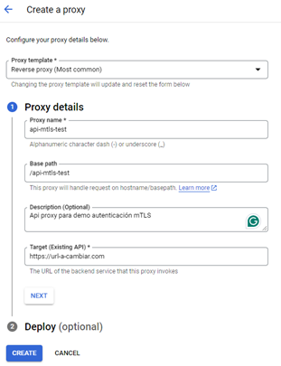

Por el momento no es necesario desplegar el proxy.

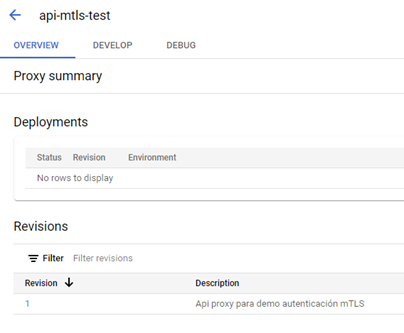

**Crear el Keystore y Truststore en Apigee.**

Para poder almacenar los certificados del cliente y del servidor se
deben crear un Truststore que permitirá almacenar el certificado de la
CA sobre el que se validara el certificado entregado por el server en la
comunicación TLS y un Keystore que almacene las llaves pública y privada
del cliente, este permitirá compartir este certificado al servidor al
momento de realizar la autenticación mutua, en este caso el servidor
validará este certificado en el momento de realizar el handshake entre
las partes.

Ambos almacenes se crean por la opción “Create Keystore” y se
diferencian por el nombre y contenido dado.


**Keystore**

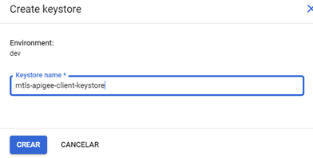

**Truststore**

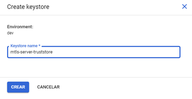

Una vez creados se debe agregar el contenido correspondiente a cada uno
de ellos.

**Keystore**

En alias definir el nombre del alias con el cual se desea identificar
este keystore, en este caso *client*, seleccionar un certificado tipo
PKCS12/PFX y seleccionar el archivo *client-apigee-keystore.p12*, como
clave se debe dejar la definida la momento de crear el keystore
(changeit).

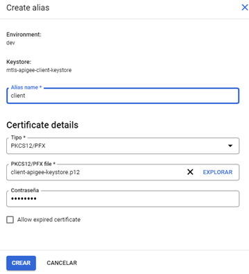

**Truststore**

En alias definir el nombre del alias con el cual se desee identificar
este truststore en este caso *ca-server*, seleccionar en tipo
“Certificate Only” y seleccionar el archivo *ca-cert.pem*

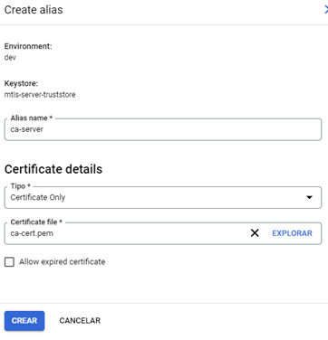

**Crear el Target server con la configuración requerida para soportar
mTLS**

Una vez creados Keystore y Trustore se puede crear el Targer Server, en
este se define la IP del servidor, el puerto, se habilita la
comunicación TLS y se habilita la comunicación en dos vías (mTLS),
también se habilita la validación estricta SSL, es decir la validación
del certificado del servidor. A continuación, se presentan las
configuraciones requeridas.

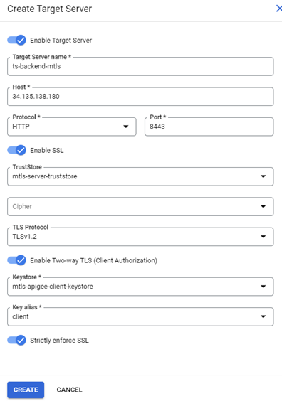

Una vez ejecutadas estas configuraciones el modelo de comunicación mTLS
se debe ver de esta manera:

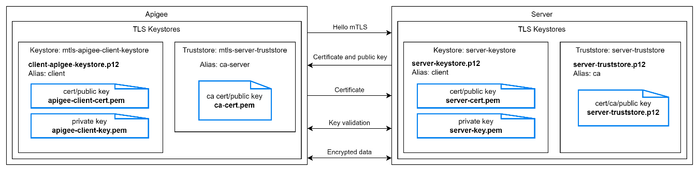

**Configuración del api proxy**

Con el Target server configurado solo queda ajustar el api proxy de
Apigee para apuntar hacia este, para ello se debe ajustar el target
endpoint de la siguiente manera y desplegar:

```xml
<?xml version="1.0" encoding="UTF-8" standalone="yes"?>
<TargetEndpoint name="default">
  <Description/>
  <FaultRules/>
  <PreFlow name="PreFlow">
    <Request/>
    <Response/>
  </PreFlow>
  <PostFlow name="PostFlow">
    <Request/>
    <Response/>
  </PostFlow>
  <Flows/>
  <HTTPTargetConnection>
    <LoadBalancer>
      <Server name="ts-backend-mtls"/>
    </LoadBalancer>
  </HTTPTargetConnection>
</TargetEndpoint>
```

 ## Realizar las pruebas de conexión desde Postman o CURL para validar los
requerimientos de autenticación entre las partes.

Una vez desplegado el proxy se pueden realizar las pruebas
correspondientes para validar la configuración realizada.

Si la prueba se realiza en postman se puede llamar directamente el api
desplegada, obteniendo como respuesta un código HTTP 200

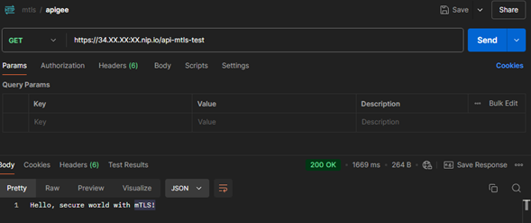

O curl:

```sh
curl -v https://34.XX.XX.XX.nip.io/api-mtls-test
   Trying 34.XX.XX.XX:443...  
 Connected
to [34.XX.XX.XX.nip.io](http://34.107.152.35.nip.io/) (34.XX.XX.XX) port
443 (#0)  
 ALPN, offering h2  
 ALPN, offering http/1.1  
  CAfile: /etc/ssl/certs/ca-certificates.crt  
  CApath: /etc/ssl/certs  
 TLSv1.0 (OUT), TLS header, Certificate Status (22):  
 TLSv1.3 (OUT), TLS handshake, Client hello (1):  
 TLSv1.2 (IN), TLS header, Certificate Status (22):  
 TLSv1.3 (IN), TLS handshake, Server hello (2):  
 TLSv1.2 (IN), TLS header, Finished (20):  
 TLSv1.2 (IN), TLS header, Supplemental data (23):  
 TLSv1.3 (IN), TLS handshake, Encrypted Extensions (8):  
 TLSv1.3 (IN), TLS handshake, Certificate (11):  
 TLSv1.3 (IN), TLS handshake, CERT verify (15):  
 TLSv1.3 (IN), TLS handshake, Finished (20):  
 TLSv1.2 (OUT), TLS header, Finished (20):  
 TLSv1.3 (OUT), TLS change cipher, Change cipher spec (1):  
 TLSv1.2 (OUT), TLS header, Supplemental data (23):  
 TLSv1.3 (OUT), TLS handshake, Finished (20):  
 SSL connection using TLSv1.3 / TLS_AES_256_GCM_SHA384  
 ALPN, server accepted to use h2  
 Server certificate:  
  subject: CN=[34.XX.XX.XX.nip.io]
  start date: Sep  3 14:55:30 2024 GMT  
  expire date: Dec  2 15:47:02 2024 GMT  
  subjectAltName: host
[34.XX.XX.XX.nip.io] matched cert\'s
[34.XX.XX.XX.nip.io]  
  issuer: C=US; O=Google Trust Services; CN=WR3  
  SSL certificate verify ok.  
 Using HTTP2, server supports multiplexing  
 Connection state changed (HTTP/2 confirmed)  
 Copying HTTP/2 data in stream buffer to connection buffer after
upgrade: len=0  
 TLSv1.2 (OUT), TLS header, Supplemental data (23):  
 TLSv1.2 (OUT), TLS header, Supplemental data (23):  
 TLSv1.2 (OUT), TLS header, Supplemental data (23):  
 Using Stream ID: 1 (easy handle 0x5636750a2550)  
 TLSv1.2 (OUT), TLS header, Supplemental data (23):  
\> GET /api-mtls-test HTTP/2  
\> Host: [34.XX.XX.XX.nip.io]
\> user-agent: curl/7.81.0  
\> accept: /  
\>  
 TLSv1.2 (IN), TLS header, Supplemental data (23):  
 TLSv1.3 (IN), TLS handshake, Newsession Ticket (4):  
 TLSv1.3 (IN), TLS handshake, Newsession Ticket (4):  
 old SSL session ID is stale, removing  
 TLSv1.2 (IN), TLS header, Supplemental data (23):  
 TLSv1.2 (OUT), TLS header, Supplemental data (23):  
 TLSv1.2 (IN), TLS header, Supplemental data (23):  
 TLSv1.2 (IN), TLS header, Supplemental data (23):  
\< HTTP/2 200  
\< content-type: application/json  
\< content-length: 30  
\< date: Mon, 23 Sep 2024 23:58:36 GMT  
\< x-request-id: 675ccfcc-4c0d-4931-a859-42d1e4269e9f  
\< via: 1.1 google  
\< alt-svc: h3=":443"; ma=2592000,h3-29=":443"; ma=2592000  
\<  
 TLSv1.2 (IN), TLS header, Supplemental data (23):  
 TLSv1.2 (IN), TLS header, Supplemental data (23):  
 TLSv1.2 (OUT), TLS header, Supplemental data (23):  
 Connection \#0 to
host [34.XX.XX.XX.nip.io](http://34.107.152.35.nip.io/) left intact  
**Hello, secure world with mTLS!**
```
Una vez ejecutada la petición sobre Apigee se evidencia el consumo
exitoso y la respuesta correspondiente del backend.

## Referencias

https://www.googlecloudcommunity.com/gc/Cloud-Product-Articles/Apigee-Southbound-Connectivity-Patterns/ta-p/77666
